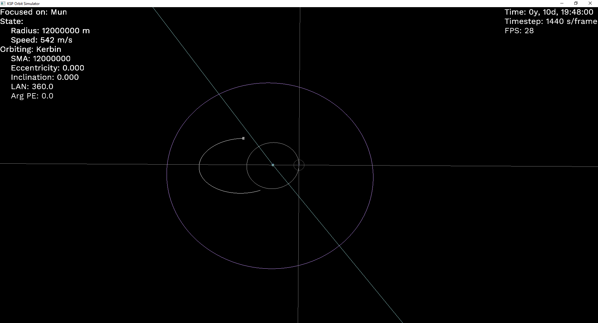

# KSP Orbit Planner

Trying to make a tool to help me plan orbital maneuvers better, because orbital mechanics is counterintuitive.
Not sure when the last time I actually played KSP was though... I've definitely spent more time on this than
the actual game.

Right now it just simulates the Kerbol system, and unpowered ships. No maneuvering capability yet, but at this
point that's more of a UI problem than a physics or software problem.

Controls
- Q and E: switch focused body
- Comma and Period: slow down and speed up time
- R: reverse direction of time
- P: pause/unpause
- Esc: quit

